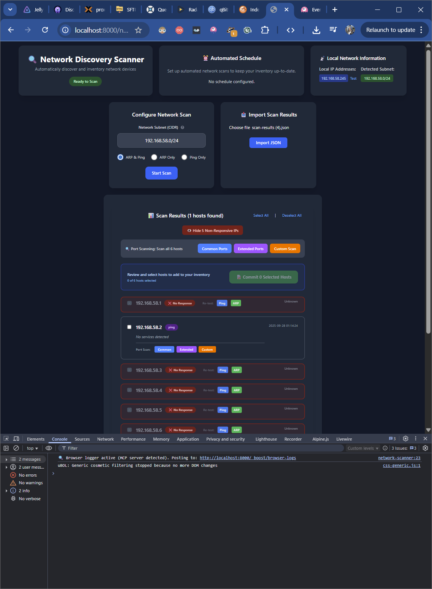

# Net Ledger

A comprehensive network inventory and asset management system, serving as a single source of truth for all network devices, services, and connections.




## ✨ Features

*   **Precise Asset Tracking**: Meticulously track and manage all network devices, cards, and interfaces
*   **Hierarchical Location Management**: Organize devices within a logical, nested location hierarchy (e.g., room > rack > rack unit)
*   **Automated Device Provisioning**: Rapidly add new devices using predefined templates
*   **Interactive Network Visualization**: Dynamic network topology visualization with:
    - Color-coded connections based on cable types (Cat6 = purple, Cat5e = cyan, Fiber = amber, etc.)
    - Hierarchical location groups representing physical spaces
    - Device-to-service logical connections in blue
    - Physical device-to-device connections with cable-specific colors
    - Real-time interactive graph using litegraph.js
*   **Modular Feature System**: Extensible architecture with lifecycle hooks for custom features
*   **Automated Discovery**: Automatically scan the network using protocols like SNMP, LLDP, and ARP to discover and onboard new assets
*   **Peer-to-Peer Data Sharing**: Enable multiple instances of Net Ledger to discover each other and synchronize data

## 🏛️ Architecture

### Database Schema

Net Ledger is built on a relational database schema designed for flexibility and scalability:

- **Locations**: Hierarchical organization (building → room → rack → rack unit)
- **Devices**: Network equipment with detailed specifications
- **Interfaces**: Physical and logical network interfaces
- **Connections**: Physical cable connections between devices with cable type information
- **Services**: Network services bound to IP addresses and ports
- **IP Addresses**: IP address management and allocation
- **History**: Complete audit trail of all asset changes

### Network Visualization Architecture

The frontend uses a **modular lifecycle-based system** built on `litegraph.js`:

*   **NetworkManager**: Core orchestrator with clear lifecycle stages:
    1. **onMount**: Initialize system and features
    2. **onPreRender**: Prepare data and build hierarchies
    3. **onCreateGroups**: Create location-based visual groups
    4. **onCreateNodes**: Create device and service nodes
    5. **onCreateConnections**: Create physical and logical connections
    6. **onRender**: Advanced rendering features (navigation dots, etc.)
    7. **onPostRender**: Cleanup and finalization

*   **Feature System**: Pluggable modules that hook into lifecycle stages:
    - **DotMapper**: Intelligent navigation dot placement for wire routing
    - **WireRenderer**: Advanced connection rendering with multiple routing algorithms
    - **ParticleSystem**: Visual effects and animations
    - **Custom Features**: Easy to create using lifecycle hooks

*   **Visual Components**:
    - **Groups**: Represent physical `Locations` in a hierarchical structure
    - **Device Nodes**: Show network equipment with interface details
    - **Service Nodes**: Display services bound to specific IP addresses and ports
    - **Color-Coded Connections**: Physical connections colored by cable type, logical connections in blue

### Feature Development

Creating new features is simple with the lifecycle hook system:

```javascript
class MyFeature {
    static onMount(context) {
        // Initialize during system startup
        return { initialized: true };
    }

    static onRender(context) {
        // Add custom rendering logic
        return { success: true };
    }
}
```

See `LIFECYCLE_DOCUMENTATION.md` for complete feature development guide.

## 🚀 Technology Stack

*   **Backend**: Laravel 12.26.2
*   **Frontend**: TALL Stack (Tailwind CSS 4.1.12, Alpine.js, Livewire 3.6.4)
*   **Database**: SQLite
*   **Visualization**: litegraph.js
*   **Build Tools**: Vite, PostCSS
*   **Code Quality**: Laravel Pint 1.24.0

## 🛠️ Getting Started

### Prerequisites

*   PHP >= 8.4
*   Composer
*   Node.js & npm
*   SQLite3

### Installation

1.  **Clone the repository**:
    ```sh
    git clone https://github.com/CharlesLennon/net-ledger.git
    cd net-ledger
    ```

2.  **Install backend dependencies**:
    ```sh
    composer install
    ```

3.  **Install frontend dependencies**:
    ```sh
    npm install
    ```

4.  **Set up environment**:
    ```sh
    cp .env.example .env
    php artisan key:generate
    ```

5.  **Set up database**:
    ```sh
    php artisan migrate --seed
    ```

6.  **Build assets and start development server**:
    ```sh
    npm run dev
    ```

7.  **Start Laravel server** (in a new terminal):
    ```sh
    php artisan serve
    ```

Your application will be available at http://localhost:8000.

### Network Visualization Features

Once running, navigate to the network view to see:

- **Hierarchical Groups**: Locations organized by building/room/rack structure
- **Device Nodes**: Network equipment with interface details
- **Service Nodes**: Services connected to specific IP addresses
- **Color-Coded Connections**:
  - Purple wires for Cat6 cables
  - Cyan wires for Cat5e cables
  - Amber wires for fiber connections
  - Blue wires for logical device-to-service connections
  - Red wires for power connections

## 🗺️ Roadmap

*   **Phase 1: Backend & Database** ✅ - Core database schema and provisioning logic implemented
*   **Phase 2: Frontend & UI** ✅ - TALL stack interface with interactive network visualization
*   **Phase 3: Automated Discovery** - Network scanning capabilities for automated data entry
*   **Phase 4: Peer-to-Peer Networking** - Host discovery and data synchronization features

## 🤝 Contributing

Contributions are welcome! Please follow these steps:

1.  Fork the Project
2.  Create your Feature Branch (`git checkout -b feature/AmazingFeature`)
3.  Commit your Changes (`git commit -m 'Add some AmazingFeature'`)
4.  Push to the Branch (`git push origin feature/AmazingFeature`)
5.  Open a Pull Request

## 📄 License

Distributed under the MIT License. See `LICENSE` for more information.

---

[View Detailed Project Plan](projectPlan.md)
